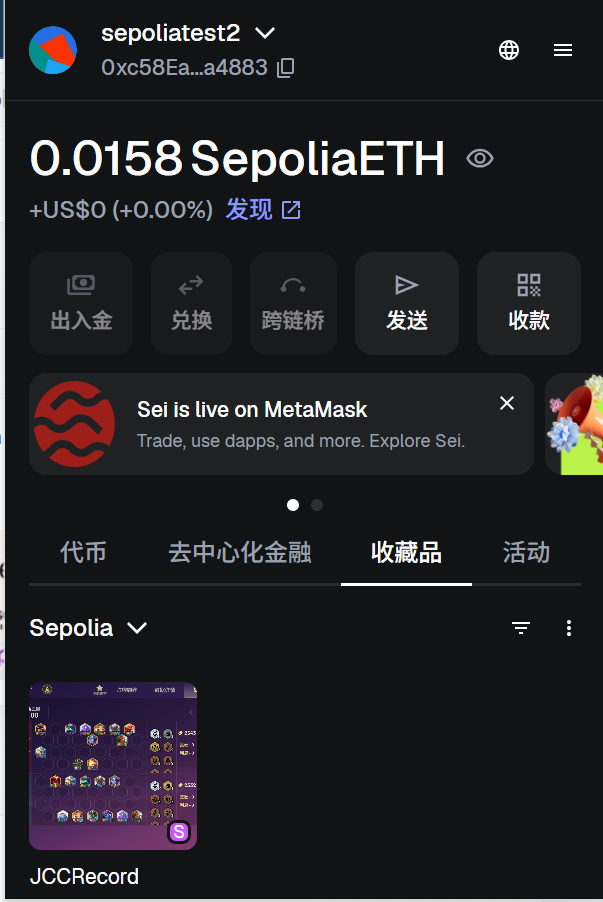
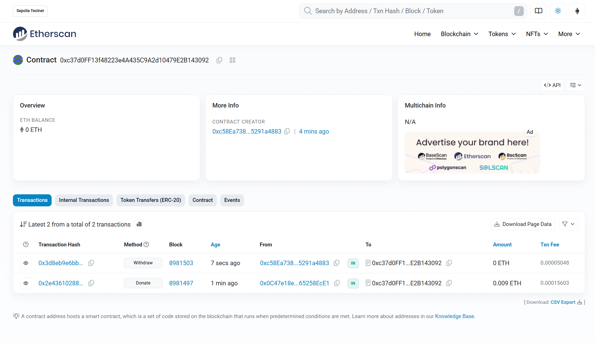
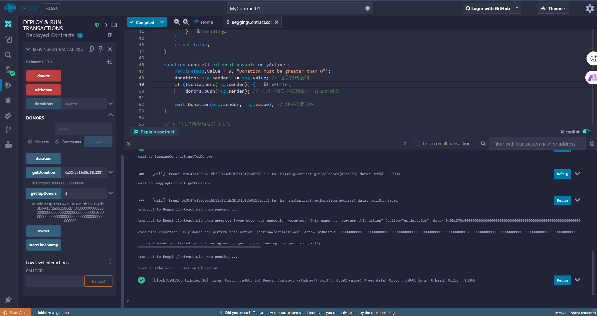

# solidity 进阶任务

## 作业1：ERC20 代币合约

### 合约地址
- [0xB4A7Cc8C99611Ead0B050C34919383D0C1fe7eBd](https://sepolia.etherscan.io/address/0xB4A7Cc8C99611Ead0B050C34919383D0C1fe7eBd)

## 作业2：NFT 合约地址

### 合约地址
- [0xc28d3fCc68C140347e5175529B8F7da6d345b7Cb](https://sepolia.etherscan.io/address/0xc28d3fCc68C140347e5175529B8F7da6d345b7Cb)

### 合约截图

## 作业3：讨饭合约

### 合约地址
- [0xc37d0FF13f48223e4A435C9A2d10479E2B143092](https://sepolia.etherscan.io/address/0xc37d0FF13f48223e4A435C9A2d10479E2B143092)

### 合约截图

### 交易截图

